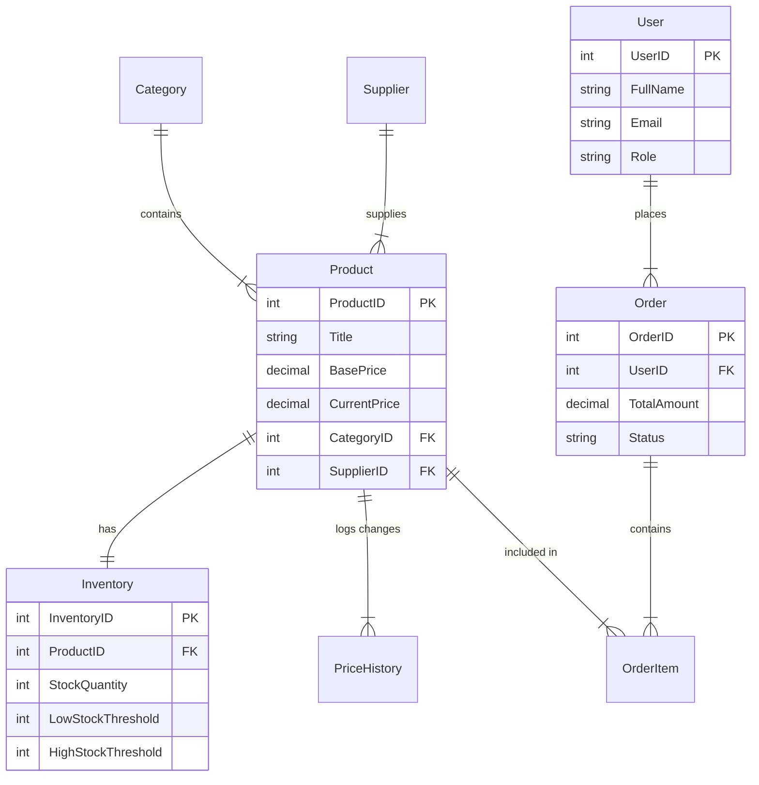

# Dynamic Pricing and Inventory Management System - Project Documentation

## 1. Project Overview

The **Dynamic Pricing and Inventory Management System** is a sophisticated e-commerce backend solution designed to automate pricing strategies based on real-time inventory levels. The core innovation of this project is its ability to automatically adjust product prices in response to stock fluctuations—increasing prices when stock is low to maximize margin, and decreasing them when stock is high to clear inventory.

This system is built using **FastAPI** for the RESTful backend, **PostgreSQL** for the relational database, and a vanilla **HTML/CSS/JS** frontend for the admin dashboard and customer store.

### Key Features
*   **Dynamic Pricing Engine**: Database triggers automatically adjust prices based on configurable stock thresholds.
*   **Real-time Inventory Tracking**: Accurate tracking of stock levels with every order.
*   **Comprehensive Dashboard**: Visual analytics for sales, revenue, and stock alerts.
*   **Multi-Role System**: Support for Customers, Sellers, and Admins.

---

## 2. ER Diagram and Data Model

The database schema is normalized to ensure data integrity and efficient querying.



### Table Descriptions
*   **User**: Stores authentication and profile details.
*   **Product**: Central entity containing pricing and descriptive data.
*   **Inventory**: One-to-one relation with Product, holding stock counts and thresholds.
*   **PriceHistory**: Logs every price change (manual or automatic) for audit and analytics.
*   **Order & OrderItem**: Standard e-commerce order processing structure.

---

## 3. CRUD Operations

The system implements full Create, Read, Update, Delete (CRUD) operations for core entities.

### Implementation Details
*   **Create**: Uses `INSERT` statements with `RETURNING` clauses to immediately provide the new ID.
    *   *Example*: Creating a product also initializes a corresponding empty `Inventory` record.
*   **Read**: standard `SELECT` queries with `JOIN`s to hydrate related data (e.g., fetching Category names when reading Products).
*   **Update**: `UPDATE` statements that only modify provided fields (partial updates).
*   **Delete**: Implements cascading soft-deletes or checks constraints before removal to maintain referential integrity.

---

## 4. API Design (Swagger/OpenAPI Usage)

The API is built with FastAPI, which auto-generates Swagger documentation at `/docs`.

### Key Endpoints

#### Products
| Method | Endpoint | Description |
| :--- | :--- | :--- |
| `GET` | `/api/products` | List all products with filtering (price, category, stock). |
| `POST` | `/api/products` | Create a new product. |
| `GET` | `/api/products/{id}` | Get detailed info for a single product. |
| `PUT` | `/api/products/{id}` | Update product details. |
| `DELETE` | `/api/products/{id}` | Remove a product. |

#### Orders
| Method | Endpoint | Description |
| :--- | :--- | :--- |
| `POST` | `/api/orders` | Place a new order. Triggers stock deduction. |
| `GET` | `/api/orders/{id}` | View order receipt and items. |

#### Dashboard
| Method | Endpoint | Description |
| :--- | :--- | :--- |
| `GET` | `/api/dashboard/stats` | High-level metrics (Revenue, Total Orders). |
| `GET` | `/api/dashboard/price-trends` | Analytics data for price change graphs. |

---

## 5. Complex SQL Queries

The system relies on advanced SQL capabilities for analytics and automation.

### Example 1: Dynamic Pricing Trigger
This PL/pgSQL function runs automatically on inventory updates.
```sql
CREATE OR REPLACE FUNCTION check_low_stock_pricing() RETURNS TRIGGER AS $$
BEGIN
    -- If stock drops below threshold, increase price by 10%
    IF NEW.StockQuantity <= NEW.LowStockThreshold THEN
        UPDATE Product SET CurrentPrice = CurrentPrice * 1.10 ...
    END IF;
    -- If stock exceeds threshold, decrease price by 10%
    IF NEW.StockQuantity >= NEW.HighStockThreshold THEN
        UPDATE Product SET CurrentPrice = CurrentPrice * 0.90 ...
    END IF;
END;
$$ LANGUAGE plpgsql;
```

### Example 2: Category Distribution Analysis
Uses `JOIN` and aggregation to visualize catalog composition.
```sql
SELECT 
    c.categoryname as name, 
    COUNT(p.productid) as value
FROM category c
LEFT JOIN product p ON c.categoryid = p.categoryid
GROUP BY c.categoryid, c.categoryname
ORDER BY value DESC;
```

---

## 6. Challenges and Solutions

| Challenge | Solution |
| :--- | :--- |
| **Localization** | The codebase was originally mixed-language (Turkish/English). We performed a systematic refactor to standardize everything, including UI text, API responses, and database seed data, to English. |
| **Data Consistency** | Ensuring stock matches orders was critical. We implemented **Database Triggers** handling the logic at the lowest level, ensuring that no application-level race condition could corrupt inventory data. |
| **Frontend Integration** | Connecting the static HTML/JS frontend to the FastAPI backend required careful CORS configuration and ensuring the JSON response structure matched the JavaScript expectations exactly. |
| **Testing** | To verify the dynamic pricing logic without manually placing thousands of orders, we created a `simulate_orders.py` script that generates realistic traffic and triggers the pricing algorithms automatically. |
